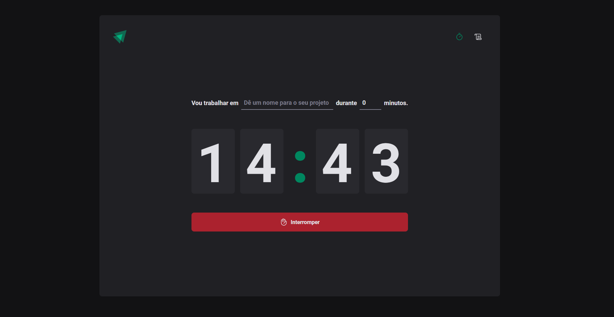
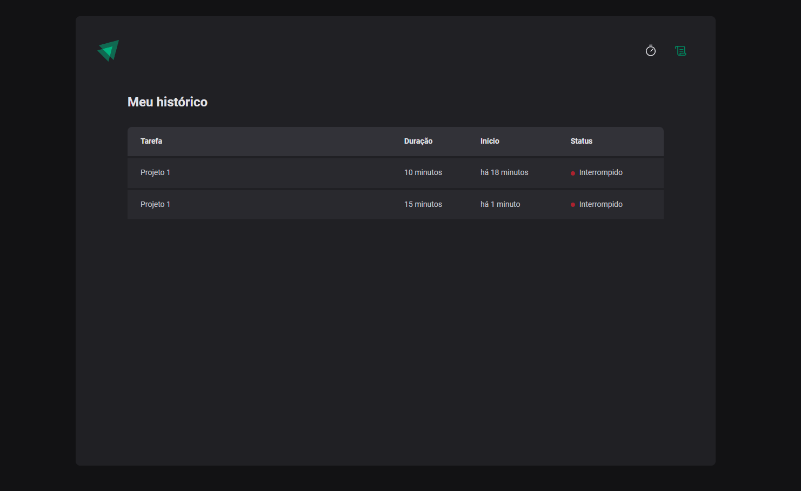

# Ignite-Timer

## Description

The Pomodoro Timer is a web application developed in React using Vite as the build tool. This project aims to help users manage their time effectively through the Pomodoro technique, which divides work time into 60-minute intervals followed by short breaks.

**Technologies Used:**

-   **React:** A JavaScript library for building user interfaces.
-   **Vite:** A build tool that provides a fast and lightweight setup for React projects.
-   **LocalStorage:** Used to store session data and keep it persistent across page reloads.
-   **Context API:** Provides a way to pass data through the component tree without having to pass props down manually at every level.
-   **React Router:** A library used to create routes and navigation within the application.

**Features:**

1. **Pomodoro Timer:**

    - Start, pause, and restart work sessions.
    - Track the remaining time for each session.

2. **Task History:**
    - View the history of all completed tasks.
    - Store the history in LocalStorage for persistent access.

**How to Use:**

1. **Start a Session:**

    - Add a new task and set the desired duration.
    - Start the countdown and focus on the task until the timer finishes.

2. **Pause/Interrupt:**

    - Pause the session at any time.
    - Interrupt the session if you need to cancel the current task.

3. **Task History:**
    - Access the history section to review all completed tasks and their respective durations.
    - Use the history to analyze your performance and identify productivity patterns.
